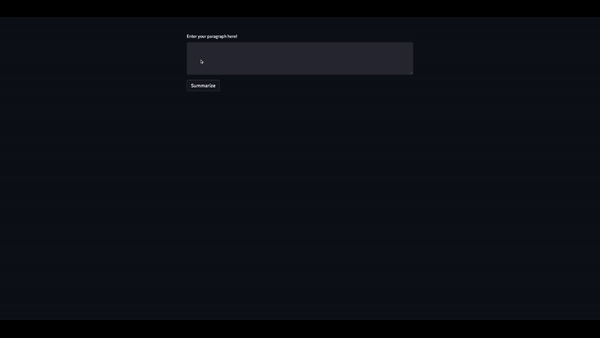

# NLP_Paragraph_Summariser_WebApp
A simple to no use no-fuss webapp to summarise your paragraphs. Think TL;DR.



1. Create a Git Repo

_Note: Heroku allows deployment using Git or Docker._

```sh
git init
```

2. Build your App

The code is in main.py

3. Test your App (Local Environment)

```sh
~$ streamlit run main.py
```

4. Create your requeriments.txt file

This file contains the libraries that your code needs to work. To do this, you can use ```pipreqs```.

```sh
pipreqs /path/to/your/app/
```
After this command, a requirements.txt will be created in the folder of your app

```
streamlit
sentencepiece
torch
transformers
```

5. Setup.sh and Procfile

Heroku needs these files for starting the app

    - setup.sh : create a streamlit folder with both credentials.toml and config.toml files.
    - Procfile : This file executes the setup.sh and then call streamlit run to run the app

```sh
# Setup.sh
mkdir -p ~/.streamlit/
echo "\
[server]\n\
headless = true\n\
port = $PORT\n\
enableCORS = false\n\
\n\
" > ~/.streamlit/config.toml
```
```sh
# Procfile
web: sh setup.sh && streamlit run main.py
```

6. Create a Heroku Account

Create a free account

7. Install Heroku CLI

[Follow these steps](https://devcenter.heroku.com/articles/getting-started-with-python#set-up)

8. Login into Heroku CLI

Move to your App folder and execute ```heroku login```

9. Deploy the App

Deploy your app by running ```heroku create``` in your app folder

10. Check it

Check your app by running ```heroku ps:scale web=1```

After that, push your code

```sh
git add .
git commit -m "message"
git push heroku master
```

11. Open it

Open your app using ```heroku open```

